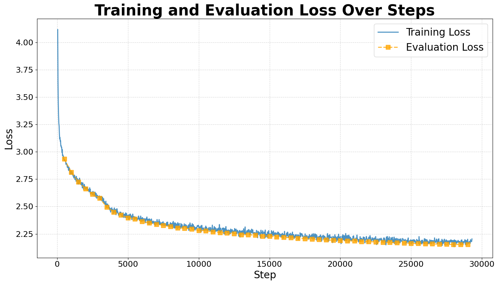

# TinyVLM

## Get Started

To install dependencies:

If you have a Nvidia GPU with more than 4GB of free VRAM, please first install torch with cuda if you haven't:

```bash
pip install torch torchvision torchaudio --index-url https://download.pytorch.org/whl/cu121
```

If you are using a apple device with an M-Chip, please simply install torch by:

```bash
pip install torch torchvision torchaudio
```

If you want to run the model on other backends supported by pytorch, please search for how to install torch with that backend and make neccessary changes to the code below.

Note: Running on CPU is not recommended as it is very ineffcient.

Then, install the transformers package and other dependencies:

```bash
pip install flask pillow transformers
```

### Web Interface

Update: Web interface is available!

Clone this repository and run

```bash
python run_server.py
```

And visit the localhost website to access the web inference interface.

### Generation Script

```python
from transformers import AutoModelForCausalLM, AutoTokenizer
from PIL import Image
import requests
import torch 

model = AutoModelForCausalLM.from_pretrained(
    "anananan116/TinyVLM",
    trust_remote_code = True,
    torch_dtype=torch.float16,
    ).to('cuda').eval()
tokenizer = AutoTokenizer.from_pretrained("anananan116/TinyVLM")

# `<IMGPLH>` is the image placeholder which will be replaced by image embeddings. 
# the number of `<IMGPLH>` should be equal to the number of input images

prompt = "Here's an image:<IMGPLH>Describe this image."
image = Image.open(requests.get('https://github.com/anananan116/TinyVLM/blob/main/test.png?raw=true',stream=True).raw)
inputs = model.prepare_input_ids_for_generation([prompt], [image], tokenizer)

with torch.no_grad():
    outputs = model.generate(
        input_ids=inputs['input_ids'].to("cuda"), 
        attention_mask=inputs['attention_mask'].to("cuda"), 
        encoded_image = inputs["encoded_image"], 
        max_new_tokens=128, 
        do_sample=True
    )

output_text = tokenizer.batch_decode(outputs, skip_special_tokens=True)
```

## Model at A Glance

### Tiny Vision-Language Model

In this project, we focus on training a vision language model. A vision language model is a neural network architecture that bridges the gap between visual and textual information, enabling AI systems to understand, describe, and reason about images in natural language. These models combine computer vision capabilities with natural language processing to perform tasks such as image captioning, visual question answering (VQA), and image-based reasoning. By learning joint representations of images and text, these models can establish meaningful connections between visual elements and linguistic descriptions, making them fundamental to applications in AI assistants, content analysis, and accessibility tools.

### Training Setup

Our training approach follows a carefully designed three-stage process:

1. **Initial Image Captioning Phase**
   - Train on a large-scale caption dataset, prioritizing breadth over precision
   - This foundational stage allows the model to:
     - Develop basic visual recognition capabilities
     - Learn broad visual-linguistic associations
     - Build a comprehensive vocabulary for describing visual content
     - Understand common objects, actions, and scenes in images

2. **Multi-Task SFT Phase**
   - Instruction tuning on:
     - VQA (Visual Question Answering) datasets
     - Knowledgeable Visual QA datasets
     - Classification datasets
     - Reasoning datasets
     - Generation datasets
   - This advanced stage enables:
     - Complex reasoning about visual content
     - Handling specific user instructions and queries
     - More nuanced and accurate image descriptions
     - Understanding and responding to diverse user prompts

3. **Instruction Tunning Phase**


The result of the two stages are our First and Final model respectively.

### "Tiny" Model

Our model combines a Llama 3.2 1B language model with a CLIP ViT-L (~400M parameters) vision encoder. This lightweight approach makes the model both practical and useful by reducing computational requirements and deployment costs while maintaining reasonable performance. The smaller footprint enables deployment on edge devices and servers with limited resources, making AI more accessible to a broader range of applications and organizations. This approach demonstrates that effective vision-language models don't necessarily require massive architectures, offering a balance between performance and efficiency.

## Data Exploration and Initial Preprocessing

- Pretraining Data
  - [Image Captioning (Text-Image Pairs)](https://huggingface.co/datasets/BAAI/CapsFusion-120M)
    - This dataset provides over 130 million image links, but we are scaling down. We downloaded the first 5 million rows of the dataset, and of these we will only use the rows where the image link gives a successful response code.
    - All initial images are not uniform in any regard, however during preprocessing, all images will be cropped
    - The dataset is cosist of a synthized caption and an url to the image.
  - Multi-Task SFT Data
    - [M3IT (Comprehensive visual instruction tunning dataset)](https://huggingface.co/datasets/MMInstruction/M3IT)
  - Instruction Tunning Daat
    - [LlavaR (Visual interaction data created by GPT-4)](https://llavar.github.io/#data)

    - [LaVA Visual Instruct 150K (Visual interaction data created by GPT-4)](https://huggingface.co/datasets/liuhaotian/LLaVA-Instruct-150K?row=0)

    - [Alpaca (Text only instruction tunning dataset, to restore text-only performance)](https://github.com/tatsu-lab/stanford_alpaca?tab=readme-ov-file#data-release)
      - These datasets provide conversation data on diverse tasks. Format varies.

### Pretraining Data

#### Download

We implemented a robust and efficient parallel downloading system for handling large-scale image datasets. The system features automatic retry mechanisms, progress tracking, and chunked processing to handle millions of images. To ensure reliability, it includes comprehensive error handling and generates detailed download statistics and error reports. The system also supports checkpoint-resume functionality, allowing interrupted downloads to continue from where they left off.

Part of the image urls are no longer available anymore as the dataset was published a few years ago. We observe that about 75% of the image can still be downloaded. Here's the download stats for the first 100k images:


#### Preprocess

For image preprocessing, we implemented an adaptive approach that intelligently handles images of varying aspect ratios:

- For images with reasonable aspect ratios (close to square), we use center cropping to maintain important visual information. After looking at the distribution of the original aspect ratio of the image, we decided to use 0.6 as the threshold for padding. Below is a histogram showing their distribution.
- For images with extreme aspect ratios, we employ a padding strategy that preserves the entire image content by adding black borders
- All images are resized to a consistent resolution (448x448) while maintaining their quality through high-quality interpolation


#### Data Exploration

To take a glance at what kinds of images are in the datasets, we perform image classification and observe the distribution of popular classes. NOTE that this method could be inaccurate since the quality of the labels are not garenteed. However, this is ONLY a data exploration practice, and it has noting to do with our training.

##### Generating labels

To effectively categorize our diverse dataset, we developed a novel approach combining GPT and CLIP to create a rich set of image labels. Rather than relying on traditional pre-defined categories (like ImageNet classes), we first created base categories and used GPT to expand each category with 50-100 semantically related descriptions. This process helped us capture the nuanced variations in our dataset while maintaining categorical coherence. The expanded label set is stored in "labels.py" and serves as the foundation for our zero-shot classification.

##### CLIP for Zero-Shot Classification

We leveraged CLIP (Contrastive Language-Image Pre-training), a powerful vision-language model that can perform zero-shot image classification through natural language descriptions. CLIP works by learning to align image and text representations in a shared embedding space, allowing it to match images with textual descriptions even for categories it hasn't explicitly been trained on.

Our implementation uses the ViT-L/14 CLIP model with the following pipeline:

1. First, we encode our custom text labels into CLIP's embedding space
2. For each image in our dataset:
   - The image is processed through CLIP's vision encoder
   - The similarity between the image embedding and all label embeddings is computed
   - The label with the highest similarity score is assigned to the image
3. The process is optimized with batch processing for efficiency

This approach allows us to categorize images using our custom-generated labels without requiring any additional training, while leveraging CLIP's robust understanding of visual-semantic relationships. The classification results provide both the matched label and a confidence score, allowing us to assess the reliability of the classifications. Below shows the most popular classes of images in our dataset.


### Data preparing for instruction tuning

1. Download questions and answers from the dataset
2. Create DataFrame from json data files which include questions and answers
3. Combine questions and answers and create a new DataFrame according to the image_id and answer_id
4. Create answers into a complete sentences
5. Add tags to indicate system prompt, user questions, and answers from the model
6. Combine system prompt, user questions, and answers into one col and label them with corrsponding image_id
7. Output the data as csv file

### Encoding Images

As we don't train the image encoder (we will mention this in detail later), we can see encoding the images as a preprocessing of the original images to make our real training more effcient. We implemented a robust and efficient image encoding pipeline to prepare our training data. The process consists of two key steps:

#### Reference-based Filtering

First, we address a common issue in large-scale web-scraped image datasets - the presence of "image not available" placeholders. A placeholder is usually a default image showing that the content is not available. Here's an example(we also use this image as the reference image):


Our solution:

- Uses a reference image that represents a typical "image not available" placeholder
- Computes CLIP embeddings for this reference image and extract the \<CLS\> position, which represent the overall semantic of the image. (No extra computation cost since it's originaly a part of image encoding).
- Calculates cosine similarity between each dataset image and the reference
- Filters out images that exceed a similarity threshold of 0.3, effectively removing various forms of placeholder images

#### Efficient Patch-based Encoding

For the remaining valid images, we employ a modified CLIP vision encoder with optimized processing:

- Processes images in batches through CLIP's ViT-L/14 architecture
- Extracts and pools patch-level features to a fixed size (64) while preserving spatial information
- Implements asynchronous disk writing and memory-efficient data handling
- Features automatic checkpointing and detailed progress tracking
- Enables efficient processing of large-scale datasets through parallel processing

This process ensures that our training data is both clean (free of placeholder images) and represented in a rich, spatially-aware format suitable for vision-language tasks.

## Model Architecture

Our model follows a vision-language architecture that combines a modified CLIP visual encoder with a Llama language model, connected through a specialized adaptation layer.

### Visual Encoder

We utilize CLIP's ViT-L/14 vision transformer as our visual backbone but modify its output processing in several key ways:

- Rather than using only the [CLS] token embedding, we extract patch embeddings from the vision transformer
- We implement a spatial pooling strategy that:
  - Removes the [CLS] token
  - Reshapes the patch embeddings into a 2D spatial grid
  - Applies average pooling to reduce the number of patches to a fixed number (64)
  - Maintains the spatial relationships between image regions
- This modified approach provides a more detailed spatial representation of the image compared to the original CLIP's single vector representation

### Large Language Model

Our system builds upon the Llama architecture, a transformer-based language model that uses:

- Multi-head self-attention mechanisms to capture long-range dependencies
- Feed-forward networks for token-level processing
- Layer normalization and residual connections
- A causal attention mask for autoregressive generation

The model processes text using a conventional token embedding layer, but is enhanced with special tokens for handling image inputs:

- `<IMAGE>`: Marks the start of image content
- `<Image_Token>`: Represents individual image patch embeddings (place holder)
- `<IMAGE_END>`: Marks the end of image content

### Vision-Language Adaptation

To bridge the semantic gap between visual and textual modalities, we implement:

- An MLP-based adapter that projects CLIP's visual features into the LLM's embedding space
- A strategy that treats visual features as special tokens in the language model:
  - Image patch embeddings are inserted at positions marked by `<Image_Token>`
  - The adapter ensures dimensional compatibility with the LLM's token embeddings
  - During generation, the model can attend to both text and image tokens seamlessly
  - The KV cache mechanism is modified to handle the hybrid input sequence efficiently

This architecture allows the model to:

1. Process images with high spatial fidelity
2. Maintain the powerful language understanding capabilities of Llama
3. Generate text that is grounded in both visual and textual context

Here's a nice figure that shows our model architecture from the [Emu 2](https://arxiv.org/abs/2312.13286) paper. Note that we did not train image generation feature in our model.


## Training

In our training, we freeze the vision encoder and only train the adapter and the LLM with language modeling objective.

### Hyperparameters

| Hyperparameters | Pretraining | Multi-Task SFT |
|-----------|--------|-------------|
| Learning rate | 2e-5 | 1e-5|
| LR decay | Cosine | Cosine |
| Weight decay | 0 | 0 |
| Per device batch size | 8 | 4 |
| Gradient accumulation steps | 8 | 8 |
| Precision | BF16 | BF16 |
| Total samples | 3.75M | 1.02M |
| Optimizer | AdamW | AdamW_bnb_8bit|
| Number of GPUs | 2 | 2 |
| Global batch size | 128 | 64 |
| Visual Encoder | Hot | Hot |
| Connector | Hot | Hot |
| LLM | Frozen | Hot |

### Training Stats

| Stats | Pretraining | Multi-Task SFT |
|-----------|--------|---------|
| GPU | 2xNvidia RTX 3090 | 2xNvidia RTX 3090 |
| Training Time | 40 Hours | 25 Hours |
| Visual Encoder Init. | openai/clip-vit-large-patch14-336 | Pretrain |
| Multi-Modal Modeling Init. | meta-llama/Llama-3.2-1B-Instruct | Pretrain |

## Results

### Pretraining Stage (Model 1)

#### Loss Plot



We notice a smooth training curve, which indicates a stable training. We also note that the model's performance on validation set matches its performance on the training set. As no regularization, e.g. dropout, is used, this is the expected behavior and there's no sign of overfit.

#### Performance on Validation Set


As our evaluation, we mainly assess our model on the BLEU score. BLEU score measures how good the model's output caption matches the ground truth caption. BLEU-n means BLEU score with n-gram. Note that though the BLEU score seems to be low in our setup, this could be caused by the extreme diveristy of the pre-training stage training captions rather than underfit of the model.


#### Conclusion for the pre-training process  

By utilizing CLIP's vision transformer and Llama architecture, we were able to get a pretty decent pre-trained model that can have high accuracy on recognizing common objects and actions. We were able to decrease the loss as the model trained, and BLEU Scores steadily increased as trained steps increased. Overall, the BLEU score and the model performance meet our initial expectation. In order to allow our model to recognize more complex and unusual objects or patterns, we will collect more VQA data from more ML resources, pre-process them, and then use them for the instruction tuning. By feeding more random and variety of images, we expect the model will have higher accuracy in general, be able to answer specific user's questions, and be better at predicting user's intent and expectations.


#### Image Caption Samples


### Multi-Task SFT Stage (Model 2)

#### Evaluations

| Model_name | Num_parameters | MME |
|----------|--------|--------|
| [Zhang199/TinyLLaVA-Qwen2-0.5B-SigLIP](https://huggingface.co/Zhang199/TinyLLaVA-Qwen2-0.5B-SigLIP)| 1B | 1153 |
| [tinyllava/TinyLLaVA-Gemma-SigLIP-2.4B](https://huggingface.co/tinyllava/TinyLLaVA-Gemma-SigLIP-2.4B) | 3B | 1339.0 |
| [Zhang199/TinyLLaVA-Qwen2.5-3B-SigLIP](https://huggingface.co/Zhang199/TinyLLaVA-Qwen2.5-3B-SigLIP)| 3.8B | 1438.7 |
| [LLaVA-1.5-7B](https://huggingface.co/llava-hf/llava-1.5-7b-hf) | 7B| 1510.7 |
| TinyVLM(Ours) | 1.5B | 1370.02 |

We observe that our model with 1.5B parameters have comparable performance when compared against some 3B models on the MME benchmark. More evaluation benchmarks are on the way.

##### MME Benchmark Results

Here we show some detailed results from the MME benchmark.

###### Perception Metrics

| Category | Score | Accuracy |
|----------|--------|-----------|
| Existence | 175.00 | 91.67% |
| Count | 75.00 | 55.00% |
| Position | 85.00 | 55.00% |
| Color | 126.67 | 73.33% |
| Posters | 79.25 | 50.68% |
| Celebrity | 86.18 | 57.35% |
| Scene | 150.25 | 83.25% |
| Landmark | 124.50 | 72.50% |
| Artwork | 99.25 | 62.75% |
| OCR | 65.00 | 55.00% |
**Total Perception Score:** 1066.09

###### Cognition Metrics

| Category | Score | Accuracy |
|----------|--------|-----------|
| Commonsense Reasoning | 91.43 | 60.00% |
| Numerical Calculation | 80.00 | 55.00% |
| Text Translation | 80.00 | 50.00% |
| Code Reasoning | 52.50 | 42.50% |
**Total Cognition Score:** 303.93

###### Overall Performance Metrics

- **Total Score:** 1370.02
- **Overall Accuracy:** 65.21%
- **Overall Precision:** 64.99%
- **Overall Recall:** 72.00%
- **Total Other Answers:** 58

###### Confusion Matrix

|          | Predicted Positive | Predicted Negative |
|----------|-------------------|-------------------|
| Actual Positive | 828 (TP) | 322 (FN) |
| Actual Negative | 446 (FP) | 720 (TN) |

In Perception, we observe that our model achieves good performance on several tasks like Existence, Color, and Scene, but fall short on some tasks like OCR, Count, and position. This could be caused by the lack of certain training data targeted at those tasks and the inherent small size of the model. Due to similar reason, we also observe a weaker performance on conition metrics.

#### QA Samples


## Acknowledgement

Most of the setups of this model are inspired by [Emu 2](https://arxiv.org/abs/2312.13286) and [Llava](https://arxiv.org/abs/2304.08485). But ALL code are original.

We used open-sourced [Llama 3.2 1B](https://arxiv.org/abs/2407.21783) model from Meta and [CLIP](https://arxiv.org/abs/2103.00020) model from OpenAI.
