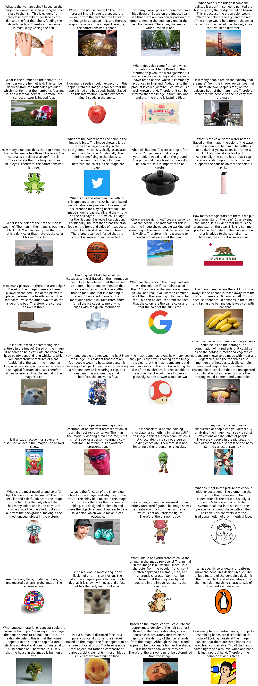

# TinyVLM

Visit our demo website: [http://anananan116.com:5000/](http://anananan116.com:5000/)

## Get Started Locally

Follow Pytorch's [official guide](https://pytorch.org/get-started/locally/) to install pytorch. Installation with CUDA is recommended if you are using Windows/Linux.

Then, install the transformers package and other dependencies:

```bash
pip install flask pillow transformers
```

### Web Interface

Clone this repository and run

```bash
python run_server.py
```

And visit the localhost website to access the web inference interface.

### Generation Script

```python
from transformers import AutoModelForCausalLM, AutoTokenizer
from PIL import Image
import requests
import torch

model = AutoModelForCausalLM.from_pretrained(
    "anananan116/TinyVLM",
    trust_remote_code = True,
    torch_dtype=torch.bfloat16,
    ).to('cuda').eval()
tokenizer = AutoTokenizer.from_pretrained("anananan116/TinyVLM")

# `<IMGPLH>` is the image placeholder which will be replaced by image embeddings.
# the number of `<IMGPLH>` should be equal to the number of input images

prompt = "Here's an image:<IMGPLH>Describe this image."
image = Image.open(requests.get('https://github.com/anananan116/TinyVLM/blob/main/assets/test_images/5.png?raw=true',stream=True).raw)
inputs = model.prepare_input_ids_for_generation([prompt], [image], tokenizer)

with torch.no_grad():
    outputs = model.generate(
        input_ids=inputs['input_ids'].to("cuda"),
        attention_mask=inputs['attention_mask'].to("cuda"),
        encoded_image = inputs["encoded_image"],
        max_new_tokens=128,
        do_sample=True
    )

output_text = tokenizer.batch_decode(outputs, skip_special_tokens=True)
print(output_text)
```

## Introduction

### Tiny Vision-Language Model

In this project, we focus on training a vision language model. A vision language model is a neural network architecture that bridges the gap between visual and textual information, enabling AI systems to understand, describe, and reason about images in natural language. These models combine computer vision capabilities with natural language processing to perform tasks such as image captioning, visual question answering (VQA), and image-based reasoning. By learning joint representations of images and text, these models can establish meaningful connections between visual elements and linguistic descriptions, making them fundamental to applications in AI assistants, content analysis, and accessibility tools.

Our model combines a Llama 3.2 1B language model with a CLIP ViT-L (~400M parameters) vision encoder. This lightweight approach makes the model both practical and useful by reducing computational requirements and deployment costs while maintaining reasonable performance. The smaller footprint enables deployment on edge devices and servers with limited resources, making AI more accessible to a broader range of applications and organizations. This approach demonstrates that effective vision-language models don't necessarily require massive architectures, offering a balance between performance and efficiency.

## Method

### Overview

Our training approach follows a carefully designed two-stage process:

1. **Initial Image Captioning Phase**

   - Train on a large-scale caption dataset, prioritizing breadth over precision
   - This foundational stage allows the model to:
     - Develop basic visual recognition capabilities
     - Learn broad visual-linguistic associations
     - Build a comprehensive vocabulary for describing visual content
     - Understand common objects, actions, and scenes in images
   - This training stage produce the first model

2. **Multi-Task SFT Phase**
   - Instruction tuning on:
     - VQA (Visual Question Answering) datasets
     - Knowledgeable Visual QA datasets
     - Classification datasets
     - Reasoning datasets
     - Generation datasets
   - This advanced stage enables:
     - Complex reasoning about visual content
     - Handling specific user instructions and queries
     - More nuanced and accurate image descriptions
     - Understanding and responding to diverse user prompts
   - This training stage produce the second model

### Data Exploration and Initial Preprocessing

- Pretraining Data
  - [Image Captioning (Text-Image Pairs)](https://huggingface.co/datasets/BAAI/CapsFusion-120M)
    - This dataset provides over 130 million image links, but we are scaling down. We downloaded the first 5 million rows of the dataset, and of these we will only use the rows where the image link gives a successful response code.
    - All initial images are not uniform in any regard, however during preprocessing, all images will be cropped
    - The dataset is cosist of a synthized caption and an url to the image.
  - Multi-Task SFT Data
    - [M3IT (Comprehensive visual instruction tunning dataset)](https://huggingface.co/datasets/MMInstruction/M3IT)
      - Comprehensive dataset for instruction tunning

#### Pretraining Data

##### Download

We implemented a robust and efficient parallel downloading system for handling large-scale image datasets. The system features automatic retry mechanisms, progress tracking, and chunked processing to handle millions of images. To ensure reliability, it includes comprehensive error handling and generates detailed download statistics and error reports. The system also supports checkpoint-resume functionality, allowing interrupted downloads to continue from where they left off.

Part of the image urls are no longer available anymore as the dataset was published a few years ago. We observe that about 75% of the image can still be downloaded. Here's the download stats for the first 100k images:


##### Preprocess

For image preprocessing, we implemented an adaptive approach that intelligently handles images of varying aspect ratios:

- For images with reasonable aspect ratios (close to square), we use center cropping to maintain important visual information. After looking at the distribution of the original aspect ratio of the image, we decided to use 0.6 as the threshold for padding. Below is a histogram showing their distribution.
- For images with extreme aspect ratios, we employ a padding strategy that preserves the entire image content by adding black borders
- All images are resized to a consistent resolution (448x448) while maintaining their quality through high-quality interpolation


##### Data Exploration

To take a glance at what kinds of images are in the datasets, we perform image classification and observe the distribution of popular classes. NOTE that this method could be inaccurate since the quality of the labels are not garenteed. However, this is ONLY a data exploration practice, and it has noting to do with our training.

###### Generating labels

To effectively categorize our diverse dataset, we developed a novel approach combining GPT and CLIP to create a rich set of image labels. Rather than relying on traditional pre-defined categories (like ImageNet classes), we first created base categories and used GPT to expand each category with 50-100 semantically related descriptions. This process helped us capture the nuanced variations in our dataset while maintaining categorical coherence. The expanded label set is stored in "labels.py" and serves as the foundation for our zero-shot classification.

###### CLIP for Zero-Shot Classification

We leveraged CLIP (Contrastive Language-Image Pre-training), a powerful vision-language model that can perform zero-shot image classification through natural language descriptions. CLIP works by learning to align image and text representations in a shared embedding space, allowing it to match images with textual descriptions even for categories it hasn't explicitly been trained on.

Our implementation uses the ViT-L/14 CLIP model with the following pipeline:

1. First, we encode our custom text labels into CLIP's embedding space
2. For each image in our dataset:
   - The image is processed through CLIP's vision encoder
   - The similarity between the image embedding and all label embeddings is computed
   - The label with the highest similarity score is assigned to the image
3. The process is optimized with batch processing for efficiency

This approach allows us to categorize images using our custom-generated labels without requiring any additional training, while leveraging CLIP's robust understanding of visual-semantic relationships. The classification results provide both the matched label and a confidence score, allowing us to assess the reliability of the classifications. Below shows the most popular classes of images in our dataset.


#### Data preparing for instruction tuning

1. Download questions and answers from the dataset
2. Create DataFrame from json data files which include questions and answers
3. Combine questions and answers and create a new DataFrame according to the image_id and answer_id
4. Create answers into a complete sentences
5. Add tags to indicate system prompt, user questions, and answers from the model
6. Combine system prompt, user questions, and answers into one col and label them with corrsponding image_id
7. Output the data as csv file

### Model Architecture

Our model follows a vision-language architecture that combines a modified CLIP visual encoder with a Llama language model, connected through a specialized adaptation layer.

#### Visual Encoder

We utilize CLIP's ViT-L/14 vision transformer as our visual backbone but modify its output processing in several key ways:

- Rather than using only the [CLS] token embedding, we extract patch embeddings from the vision transformer
- We implement a spatial pooling strategy that:
  - Removes the [CLS] token
  - Reshapes the patch embeddings into a 2D spatial grid
  - Applies average pooling to reduce the number of patches to a fixed number (64)
  - Maintains the spatial relationships between image regions
- This modified approach provides a more detailed spatial representation of the image compared to the original CLIP's single vector representation

#### Large Language Model

Our system builds upon the Llama architecture, a transformer-based language model that uses:

- Multi-head self-attention mechanisms to capture long-range dependencies
- Feed-forward networks for token-level processing
- Layer normalization and residual connections
- A causal attention mask for autoregressive generation

The model processes text using a conventional token embedding layer, but is enhanced with special tokens for handling image inputs:

- `<IMAGE>`: Marks the start of image content
- `<Image_Token>`: Represents individual image patch embeddings (place holder)
- `<IMAGE_END>`: Marks the end of image content

#### Vision-Language Adaptation

To bridge the semantic gap between visual and textual modalities, we implement:

- An MLP-based adapter that projects CLIP's visual features into the LLM's embedding space
- A strategy that treats visual features as special tokens in the language model:
  - Image patch embeddings are inserted at positions marked by `<Image_Token>`
  - The adapter ensures dimensional compatibility with the LLM's token embeddings
  - During generation, the model can attend to both text and image tokens seamlessly
  - The KV cache mechanism is modified to handle the hybrid input sequence efficiently

This architecture allows the model to:

1. Process images with high spatial fidelity
2. Maintain the powerful language understanding capabilities of Llama
3. Generate text that is grounded in both visual and textual context

Here's a nice figure that shows our model architecture from the [Emu 2](https://arxiv.org/abs/2312.13286) paper. Note that we did not train image generation feature in our model.


### Training

In our training, we freeze the vision encoder and only train the adapter and the LLM with language modeling objective.

#### Hyperparameters

| Hyperparameters             | Pretraining | Multi-Task SFT |
| --------------------------- | ----------- | -------------- |
| Learning rate               | 2e-5        | 1e-5           |
| LR decay                    | Cosine      | Cosine         |
| Weight decay                | 0           | 0              |
| Per device batch size       | 8           | 4              |
| Gradient accumulation steps | 8           | 8              |
| Precision                   | BF16        | BF16           |
| Total samples               | 3.75M       | 1.02M          |
| Optimizer                   | AdamW       | AdamW_bnb_8bit |
| Number of GPUs              | 2           | 2              |
| Global batch size           | 128         | 64             |
| Visual Encoder              | Hot         | Hot            |
| Connector                   | Hot         | Hot            |
| LLM                         | Frozen      | Hot            |

#### Training Stats

| Stats                      | Pretraining                       | Multi-Task SFT    |
| -------------------------- | --------------------------------- | ----------------- |
| GPU                        | 2xNvidia RTX 3090                 | 2xNvidia RTX 3090 |
| Training Time              | 40 Hours                          | 25 Hours          |
| Visual Encoder Init.       | openai/clip-vit-large-patch14-336 | Pretrain          |
| Multi-Modal Modeling Init. | meta-llama/Llama-3.2-1B-Instruct  | Pretrain          |

### File Structure

```
data
├── prepare_pretrain.py
├── adapt_pretrain_data.py
├── prepare_instruction_tunning.py
├── adapt_it_data.py
src
├── model
│   ├── llama
│   │   ├── modeling_llama.py
```

## Pretraining

To create any vision-language model, we need to pretrain in order to prepare the model for tasks like image captioning or text-image retrieval. For our case, this allows our model to use joint representations of visual and textual data from our dataset, and it accounts for our limited computational resources while still achieving strong performance.

### How we did it

The program we made for pretraining is located at [main/pretrain.py](https://github.com/anananan116/TinyVLM/blob/main/main/pretrain.py).

This program makes use primarily of the PyTorch and Transformers libraries, and the main() function serves to conduct the whole pretraining pipeline, including argument parsing, model training and evaluation. The HfArgumentParser is used to parse the command-line arguments that were preprocessed from our data into interpretable objects. We then load our model configurations as model_args, along with additional tokens. The get_model_and_tokenizer() is used to initialize the VLM model, tokenizer, special token mapping, and processor.

To prepare our data, the program uses the VLMData class in order to prepare the training and evaluation datasets, and a collator function is made to handle batching and preprocessing. We chose to freeze the model parameters, which limits the model training to specific parts, and keeps vision-related parameters trainable. At this point, the VLMTrainer is initialized, and we then use its train() method to train the model, and lastly we evaluate this model using its evaluate() method.

After running this program, our model is pretrained, which allows us to move forward on the instruction tuning.

## Instruction Tuning

Instruction tuning is an important part of the learning process for a pretrained model, and especially for our case with our VLM. In this step, we are giving instructions and step by steps to specified problems and giving a solution to it. In doing do we are able to improve metrics on our model and help guide the model to learn better and provide more meaningful responses than without this step.

### How we did it

First we made the individual datasets from some of the questions and answers we got from

- [LLaVa](https://huggingface.co/datasets/liuhaotian/LLaVA-Instruct-150K)
- [LLaMa](https://github.com/tatsu-lab/stanford_alpaca?tab=readme-ov-file#data-release)
- [VQA](https://visualqa.org/download.html)

In which we did the what has been laid out [here](https://github.com/anananan116/TinyVLM?tab=readme-ov-file#data-preparing-for-instruction-tuning)

The files in which contain these are at [exploration/170ktokenize.ipynb](https://github.com/anananan116/TinyVLM/blob/main/exploration/170ktokenize.ipynb), [exploration/alpaca.ipynb](https://github.com/anananan116/TinyVLM/blob/main/exploration/alpaca.ipynb), and [exploration/q_and_a.ipynb](https://github.com/anananan116/TinyVLM/blob/main/exploration/q_and_a.ipynb)

At the end of processing the questions and answers, we output each of them to CSV files so that it can be used in our model.

From here we go to process the questions and answers within the structure of [data/prepare_instruction_tuning.py](https://github.com/anananan116/TinyVLM/blob/main/data/prepare_instruction_tunning.py) and [data/adapt_it_data.py](https://github.com/anananan116/TinyVLM/blob/main/data/adapt_it_data.py).

<br>

Where inside of the [prepare_instruction_tuning.py](https://github.com/anananan116/TinyVLM/blob/main/data/prepare_instruction_tunning.py) file, we are downloading these said images from a passed in csv file. From there we are normalizing every image, and processing every image while retaining the information of the images for later. Essentially, this file is designed to preprocess the passed csv file, and download images associated with said photo_id. And afterwards, we are outputing the result as a csv for use by [data/adapt_it_data.py](https://github.com/anananan116/TinyVLM/blob/main/data/adapt_it_data.py).

Inside of [data/adapt_it_data.py](https://github.com/anananan116/TinyVLM/blob/main/data/adapt_it_data.py), we are validating the outputted csv file. Where we are handling the missing values of important features, input and instruction, and replacing with empty strings. Also merging inputs and those features whenever desired/needed. We are also processing each of the images as well verifying if valifity of the image, where if it is valid image, we pass it into OpenAI's CLIP model again to be preprocessed. Once everything that is can be processed is, we output into a new csv file for use by [main/instruction_tuning.py](https://github.com/anananan116/TinyVLM/blob/main/main/instruction_tunning.py). Where in instruction_tuning.py, it will leverage these results to make better and more accurate outputs.

## Evaluation on MME

MME is a benchmark for evaluating Multimodal Large Language Model(MLLM), which is a more advanced version of LLM that can accept input more than just text data. MME benchmark has 14 subtasks in total to fully explore, test, and evolution the full potential of a MLLM, and each subtask can be scored up to 200 points. MME is trustworthy to test our model since it successfully and comprehensively evaluates a total of 30 advanced MLLMs including BLIP-2, LLaVa, MiniGPT-4, ect...

### Perception Metrics:

Existence - The ability to recognize something exist

Count - The ability to have the correct count of certain item

Position - The ability to locate items' positions

Color - The ability to recognize the color of certain area, scene, or items

Posters - The ability to recognize the posters from movie

Celebrity - The ability to recognize the famous people

Scene - The ability to determine what scene is it from

Landmark - The ability to determine what Landmark is it

Artwork - The ability to determine what Artwork is it

OCR - The ability to perform Optical Character Recognition, a technology used to identify and extract text from images

The program is located at [eval/eval.ipynb](https://github.com/anananan116/TinyVLM/blob/main/eval/eval.ipynb)

For more details of this benchmark please refer to https://arxiv.org/abs/2311.13165

#### How we did it:

1. We loaded our model and tokenizer
2. We loaded our dataset MME that contains image and question pairs
3. Create our Collator class to process batches from the dataset and output it as dictionary in desired structure
4. Create a dataloader to prepare test sets(batches) for evaluation with a batch size of 16
5. For each batch, combine image and question and let our model to generate predictions
6. Compare the predictions with the dataset answer while in the inference loop
7. Save the result into a json file
8. The rest of the code, starting from the QA sample, are our demo input question and answers from the model.

### Result calculation and Confusion Matrix:

We use an evaluation calculation program from [here](https://github.com/BradyFU/Awesome-Multimodal-Large-Language-Models/tree/Evaluation) to calculate our saved result from our previous calculation

#### How we did it:

1. We load the result json file and format our result
2. Use the provided setting from the original code and run process_result
3. We got our Confusion Matrix and tables

## Results

### Pretraining Stage (Model 1)

#### Loss Plot


We notice a smooth training curve, which indicates a stable training. We also note that the model's performance on validation set matches its performance on the training set. As no regularization, e.g. dropout, is used, this is the expected behavior and there's no sign of overfit.

#### Performance on Validation Set


As our evaluation, we mainly assess our model on the BLEU score. BLEU score measures how good the model's output caption matches the ground truth caption. BLEU-n means BLEU score with n-gram. Note that though the BLEU score seems to be low in our setup, this could be caused by the extreme diveristy of the pre-training stage training captions rather than underfit of the model.

#### Conclusion for the pre-training process

By utilizing CLIP's vision transformer and Llama architecture, we were able to get a pretty decent pre-trained model that can have high accuracy on recognizing common objects and actions. We were able to decrease the loss as the model trained, and BLEU Scores steadily increased as trained steps increased. Overall, the BLEU score and the model performance meet our initial expectation. In order to allow our model to recognize more complex and unusual objects or patterns, we will collect more VQA data from more ML resources, pre-process them, and then use them for the instruction tuning. By feeding more random and variety of images, we expect the model will have higher accuracy in general, be able to answer specific user's questions, and be better at predicting user's intent and expectations.

#### Image Caption Samples


### Multi-Task SFT Stage (Model 2)

Since it will be difficult and time-consuming to run our fine tuning on a single notebook, we choose to break them down into different python files instead.

#### loss plot


Since our model is huge and took an average of 80 hrs to train, it will be difficult for us to compute an official fitting graph. Though the concept of overfitting is far far more complex than the graph shows when we are training models this size... We do have overfit because of the inherent bias of the datasets, but that's much more subtle stuff. \I think our next model will be doing more fine tuning to the current ones. We can continue to collect more data and do more instruction tuning in order to add more features to our model and provide a better accuracy on handling more complex images and scenes.

#### QA Samples



#### Evaluations

| Model_name                                                                                            | Num_parameters | MME     |
| ----------------------------------------------------------------------------------------------------- | -------------- | ------- |
| [Zhang199/TinyLLaVA-Qwen2-0.5B-SigLIP](https://huggingface.co/Zhang199/TinyLLaVA-Qwen2-0.5B-SigLIP)   | 1B             | 1153    |
| [tinyllava/TinyLLaVA-Gemma-SigLIP-2.4B](https://huggingface.co/tinyllava/TinyLLaVA-Gemma-SigLIP-2.4B) | 3B             | 1339.0  |
| [Zhang199/TinyLLaVA-Qwen2.5-3B-SigLIP](https://huggingface.co/Zhang199/TinyLLaVA-Qwen2.5-3B-SigLIP)   | 3.8B           | 1438.7  |
| [LLaVA-1.5-7B](https://huggingface.co/llava-hf/llava-1.5-7b-hf)                                       | 7B             | 1510.7  |
| TinyVLM(Ours)                                                                                         | 1.5B           | 1370.02 |

We observe that our model with 1.5B parameters have comparable performance when compared against some 3B models on the MME benchmark. More evaluation benchmarks are on the way.

##### MME Benchmark Results

Here we show some detailed results from the MME benchmark.

###### Perception Metrics

| Category  | Score  | Accuracy |
| --------- | ------ | -------- |
| Existence | 175.00 | 91.67%   |
| Count     | 75.00  | 55.00%   |
| Position  | 85.00  | 55.00%   |
| Color     | 126.67 | 73.33%   |
| Posters   | 79.25  | 50.68%   |
| Celebrity | 86.18  | 57.35%   |
| Scene     | 150.25 | 83.25%   |
| Landmark  | 124.50 | 72.50%   |
| Artwork   | 99.25  | 62.75%   |
| OCR       | 65.00  | 55.00%   |

**Total Perception Score:** 1066.09

###### Cognition Metrics

| Category              | Score | Accuracy |
| --------------------- | ----- | -------- |
| Commonsense Reasoning | 91.43 | 60.00%   |
| Numerical Calculation | 80.00 | 55.00%   |
| Text Translation      | 80.00 | 50.00%   |
| Code Reasoning        | 52.50 | 42.50%   |

**Total Cognition Score:** 303.93

###### Overall Performance Metrics

- **Total Score:** 1370.02
- **Overall Accuracy:** 65.21%
- **Overall Precision:** 64.99%
- **Overall Recall:** 72.00%
- **Total Other Answers:** 58

###### Confusion Matrix

|                 | Predicted Positive | Predicted Negative |
| --------------- | ------------------ | ------------------ |
| Actual Positive | 828 (TP)           | 322 (FN)           |
| Actual Negative | 446 (FP)           | 720 (TN)           |

#### Conclusion to the second model

In Perception, we observe that our model achieves good performance on several tasks like Existence, Color, and Scene, but falls short on some tasks like OCR, Count, and position. This could be caused by the lack of certain training data targeted at those tasks and the inherent small size of the model. Due to similar reasons, we also observe a weaker performance on condition metrics. So far, we followed the blueprint of our project as planned in the early phase. By doing instruction tuning, we were able to allow our model to have chatgpt-like conservation other than simply through cold descriptions on images. Our model now is able to interpret what we want from our question and be able to answer as a personal assistance. We will continue to work on the model by doing more kinds of fine-turning to make it even more powerful to handle confused, unseen, and more complex scenes or images.

## Dicussion 
Since training a LLM model needs a lot of data, we explored many different sources to gather enough data. We mainly choose to use the VQA data sources, which usually come with pictures, questions, and answers. By doing so, it fits our purpose of training a Vision language model since we want our model to be able to respond to pictures and questions and give proper answers. Furthermore, we formatted the data into <token> content structure so that it will be easy for us to use them during the pretraining and the instruction tuning process. Moving on, in the pretraining stage of the model, we freeze the LLM and only train the vision encoder because the answers from our pre-training data are too simple and straightforward. This will ruin the style of output of our original LLM model, and we tried to avoid that. In the instruction tuning phase, the answers from the instruction tuning model are more human like. Therefore, we allow both vision encode and the LLM model to be trained in order to achieve better accuracy and get more functionality. However, after the instruction tuning is done, we notice that at some point the style of our LLM response is not proper. For example, even though we ask different questions like what is in the picture or what can you see from the picture, it always starts the output by “The answer is…” It is because even though we have higher quality of data in the instruction tuning, some of our data’s answers are just a single word response “yes” or “no”. This leads to the style of output not following the instruction we set. One solution we came up with is to feed those low quality questions and answers into chatgpt by using the api program we made. By doing so, the answers for those data will be more descriptive and human-like. However, we realize that would cost over 200 dollars to finish transforming our data and end up giving up on that idea. One other improvement that we can possibly do is to increase the number of patches that we tokenize. Currently, our model only uses 64 patches, but if we use double the amount or more, it will increase the accuracy for our model to analyze more complex and detailed pictures. Overall, the model we trained fulfilled our initial goal by successfully adding a picture reading functionality to the LLM model. It also fulfills the purpose of the group project by exploring and attempting the neural network and LLM models. 


## Statement of Collaboration

Zihan Liu - zil065@ucsd.edu

- Worked on README

Zhenyu Jiang - zhj014@ucsd.edu

- Worked on README

Henry Tran - het002@ucsd.edu

- Worked on README
- Assissted in the Instruction Tuning
- Worked on the Data Exploration

Charlie Gillet - cgillet@ucsd.edu

- Worked on README
- Wrote program to download all images
- Worked on the Data Preprocessing

## Acknowledgement

Most of the setups of this model are inspired by [Emu 2](https://arxiv.org/abs/2312.13286) and [Llava](https://arxiv.org/abs/2304.08485). But ALL code are original.

We used open-sourced [Llama 3.2 1B](https://arxiv.org/abs/2407.21783) model from Meta and [CLIP](https://arxiv.org/abs/2103.00020) model from OpenAI.
